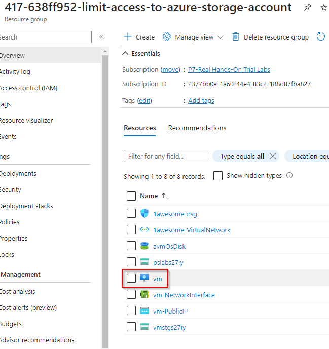
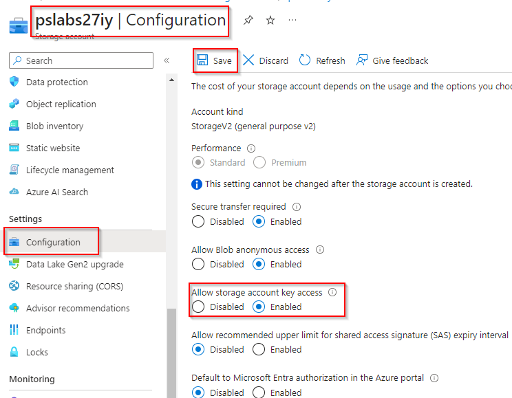

# Limit Access to Azure Storage Account Using SAS URI

**There are 2 objectives with this lab:**
* Prepare Testing Environment
* Create and Test a SAS Token

## Prepare Testing Environment

Lets first create our storage account and a file share which we'll name `fileshare1`. So, search for storage account in the search bar. 

## Create and Test a SAS Token

For the second portion of this lab, we need to connection our file share to the virtual machine (VM) in our resource group (RG). So, find the pre-configured VM named `winVM`. 

 

Lab completed!

## Personal Notes

Another straight forward lab. I was actually having some problems RDP'ing into the VM because I was getting a Zscaler block on my corporate computer. We got that worked out and everything else was fine here. Also, I need to make note that a .TXT file automatically appends .txt to a newly 
