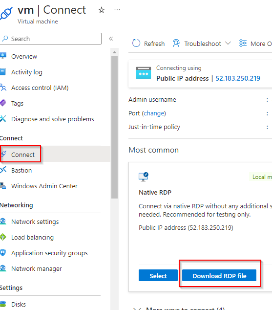

# Limit Access to Azure Storage Account Using SAS URI

**There are 2 objectives with this lab:**
* Prepare Testing Environment
* Create and Test a SAS Token

## Prepare Testing Environment

In the first part of the lab, we need to set up our virtual machine (VM) environment and make sure we have everything in our storage container. So, lets go into our VM first. I went into my resource group (RG) and chose `vm`.

Lets RDP into our VM. I've gone over this process before but on the lefthand side, go to Connect > Connect. Click the Download RDP file button and then you should get a download file. 

Go through the prompt and give the RDP session the VM passcode supplied by the A Cloud Guru (ACG) lab. You should then be taken to the VM. Once in the VM, click on the icon at the bottom of the display. I recognize this icon as the Azure Storage Explorer icon based on the AZ-104 course. That should bring up the application. Once here, click on `Attach to a resource`

Select `Storage account or service`.

Now select `Shared access signature URL (SAS)`.

Before we move any further, I was instructed to create two files locally that we'll eventually store in the Azure portal. So I created `ACG1.txt` and `ACG2.txt`. I did this on my computer, not the VM. 

Lets go into the portal and choose the `pslabs` storage account.

Go the lefthand side and go to Data storage > Containers. Here, click the `+ Container` button and you'll bring a panel on the right side of the screen. Give the container a name and create it.

Click on your newly created container and then click `Upload`. I uploaded those two locally created files here.

Those files should autopopulate once they're done being uploaded. 

That completes the first half of this lab!

## Create and Test a SAS Token

For the second portion of this lab, we need to allow the Azure portal to allow shared access signatures (SAS) to connect to the VM's Storage Explorer. So lets do that. 

Gointo the `pslabs` storage account again and this time, navigate to Settings > Configuration. Here, we're going to enable `Allow storage account key access`. Make sure to save your changes at the top of the screen. 

Now, we can stay in the storage account but this time, we'll go to Security + networking > Shared access signature. The lab instructs us to choose Blob for Allowed Services, all options for Allowed resource types, read and list for Allowed permissions, and keep everything default. It just wanted us to make sure the Allowed protocols was HTTPS only which was already selected. So within all of this, I want us to just make a note of the permissions. We only have Read and List permissions. We cannot write or delete anything. 

From here, we can scroll to the bottom of this page and click the big `Generate SAS and connection string` button. We'll choose the bottom option which is Blob service SAS URL. 

Lets head back to the VM. Paste that SAS URL into the Service URL page and hit Next. 

Make note of the permissions again. After that, hit Connect. 

Now, the storage container we created should pop up in the Storage Explorer! Pretty cool right? And the two text files we created are also there. Now lets expirement with the two files. 

If you click on the files, you'll see they say exactly what they said originally. 

Now, I altered the file but apparently I didn't get that in the screenshot so just trust me. After I saved it with the modifications, I reuploaded the file and clicked Apply. 

You'll notice I got an error message at the bottom and when I tried to reopen the file, it was the same as it originally was. So that means the permissions are active. I'm only able to Read and List, not modify. 

To further bring this home, I tried to delete the second file. 

Notice I also get a failure notice and the file remains.

Lab completed!

## Personal Notes

This lab also wasn't bad. I think it was cool just watching the storage account pop up in the VM. Feels like magic when these computers talk sometimes. It was nice to finally get my hands on SAS technology. I feel like I see SAS tokens all the time but have never worked with them. Anyway, cool.  
